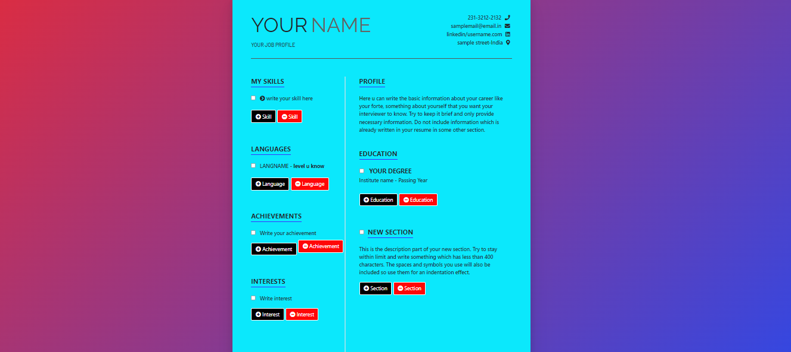

# Resume-builder

## I'm Rahul Raj Sharma, a full stack and software developer. Welcome to my Resume Builder project, a user-friendly web application developed using HTML, CSS, and JavaScript that allows users to create professional resumes effortlessly.

Explore this project to see how it facilitates the creation of resumes through a straightforward interface for entering personal, educational, and professional details. The application dynamically generates a formatted resume that users can download or print.
